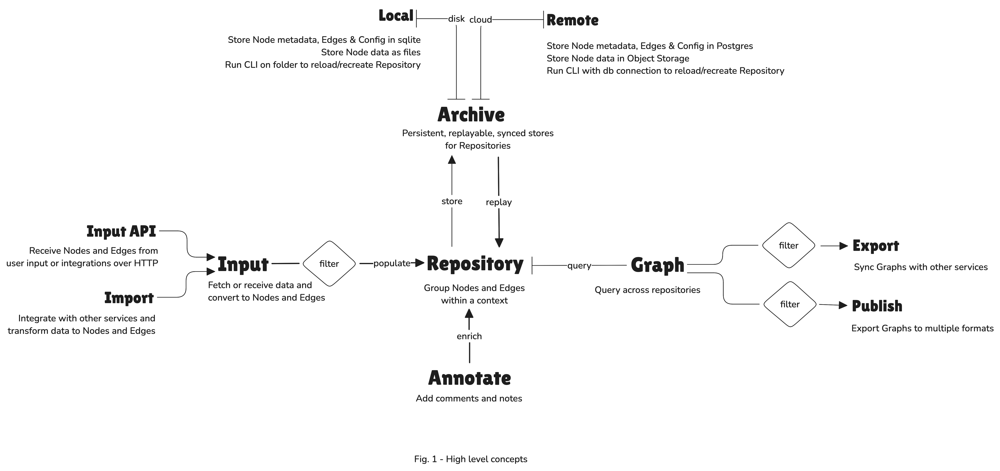

# Upspeak

Upspeak is a robust knowledge management and information processing system designed to collect, organise, and synthesise data from web sources and personal inputs.

## Introduction

Upspeak will let you build information archives (repositories) that can be synthesised into knowledge graphs. These repositories will gather data from any system accessible over HTTP, allowing you to annotate the data and send replies back within their contexts.

Upspeak will integrate with tools you already use to consume or create information in multiple shared contexts, such as Matrix, Discourse, and the Fediverse.

## High Level Concepts

1. **Repository**: The core component where all data will be collected, organised, and managed. It will interface with both local and remote Archives.
2. **Archives**: Data sinks that can be local (on the user's device) or remote (web sources accessible over HTTP). This separation will allow flexible data management.
3. **Nodes and Edges**: Fundamental elements within the Repository. Nodes will represent data points, while Edges will define relationships between these points, forming a structured knowledge graph.
4. **Annotation**: Users will be able to annotate data within the Repository, linking and contextualising information to enrich their knowledge graph.
5. **Integration with External Tools**: Upspeak will integrate with tools like Matrix, Discourse, and the Fediverse, enabling seamless data flow and interaction in shared contexts.

## Data Flow

1. **Input**: Data will be gathered from local and remote sources.
2. **Processing**: Data will be organised and managed within the Repository.
3. **Annotation**: Users will annotate and link data, enriching the knowledge base.
4. **Output**: Annotated data will be shared back to external tools and platforms.

This modular and extensible architecture will ensure flexibility and scalability, guiding the development of Upspeak.

## License

Upspeak is licensed under the Apache License, Version 2.0 (Apache-2.0). See the [LICENSE](LICENSE) file for the full license text.
