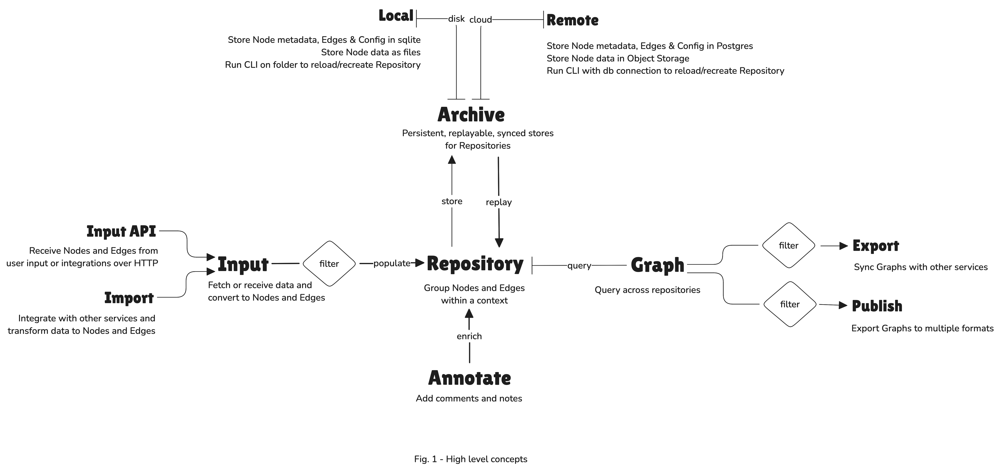

# Upspeak

Upspeak is a personal knowledge management system and information client designed to collect, organise, and synthesise data from web sources and your own inputs.


[](https://github.com/upspeak/upspeak/actions/workflows/build-and-test.yml)

## Introduction

Upspeak will let you build personal knowledge repositories into queryable information archives. These repositories can include local data (notes you write) as well as gather data from any system accessible over HTTP, allowing you to annotate the data and send replies back within their contexts.

Upspeak will integrate with tools you already use to consume or create information in multiple shared contexts, such as Matrix, Discourse, and the Fediverse.

## High Level Concepts



1. **Repository**: The core component where all data will be collected, organised, and managed. It will interface with both local and remote Archives.
2. **Archives**: Persistent, replicable, synced stores for Repositories. Archives can be local (SQLite metadata and node data as files on the user's device) or remote (Postgres metadata and node data in object storage). This separation will allow flexible data management across devices and deployment modes.
3. **Nodes and Edges**: Fundamental elements within the Repository. Nodes will represent data points, while Edges will define relationships between these points, forming a structured knowledge graph.
4. **Threads and Annotations**: Threads will group nodes into ordered collections. Annotations will let users add comments, highlights, and notes targeting specific nodes, enriching the knowledge graph with contextual information.
5. **Filters and Rules**: Reusable condition sets will control what data flows between sources, sinks, and repositories. Rules will automate actions based on events, enabling an autonomous data processing pipeline.
6. **Connectors**: Upspeak will integrate with tools like Matrix, Discourse, RSS, the Fediverse, email, and webhooks, enabling seamless data flow and interaction in shared contexts.

## Architecture

Upspeak is an **API-first** knowledge infrastructure. It provides a structured knowledge graph for collecting, organising, and querying information from diverse sources. Clients (web, mobile, CLI, AI agents) connect over the HTTP API.

Upspeak uses a **hybrid synchronous core + JetStream** architecture:
- Writes go synchronously to the archive (confirmed to the client)
- JetStream carries the downstream consequences (events, sync, background processing)

Upspeak is **local-first**: offline writes succeed immediately and sync when reconnected. The system runs autonomously in the background (fetching sources, applying rules, processing data) and presents results when the user connects.

See `docs/specs/api-foundation/` for the complete API specification.

## Develop

```bash
# Build the binary
./build.sh build

# Development mode (requires upspeak.yaml)
cp upspeak.sample.yaml upspeak.yaml
./build.sh dev

# Run tests
go test ./...

# Clean build artifacts
./build.sh cleanup
```

## License

Upspeak is licensed under the Apache License, Version 2.0 (Apache-2.0). See the [LICENSE](LICENSE) file for the full license text.
